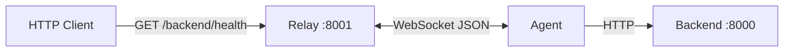

# nam-tunnel

A minimal HTTP reverse proxy over a single WebSocket. Public clients send HTTP to a **relay** on the internet; traffic is tunneled to an **agent** running behind NAT or a firewall; the agent forwards real HTTP to a local **backend**.

```
[Client] --HTTP--> [relay :8001] <--WebSocket--> [agent] --HTTP--> [backend :8000]
```

Useful for exposing local development servers, internal APIs, or services that cannot accept inbound connections directly.

## Features

- **Real HTTP tunneling** — Method, path, query string, headers, and body are forwarded; responses include status, headers, and body.
- **Concurrent requests** — Multiple in-flight HTTP requests per tunnel via request/response correlation IDs.
- **Reconnect** — A new agent connection with the same tunnel ID replaces the previous one.
- **Disconnect handling** — Pending requests fail fast with HTTP 502 when the agent drops.
- **Per-request timeout** — 60 second limit on the relay for each proxied request.
- **User & PAT management** — SQLite-backed REST API for users and personal access tokens (foundation for future tunnel auth).

## Project layout

| Component | Path | Role |
|-----------|------|------|
| Relay | `relay/` | Public HTTP server, WebSocket registry, user/PAT API |
| Agent | `agent/` | Outbound WebSocket client; executes HTTP against a local URL |
| Protocol | `protocol/` | JSON request/response framing over WebSocket |
| Backend | `backend/` | Demo HTTP app for local testing |
| Migrations | `cmd/migrate/` | Standalone database migration CLI |
| Docs | `docs/` | Implementation notes and enhancement roadmap |

## Requirements

- Go 1.26+

## Quick start

Run three processes in separate terminals:

```bash
# Terminal 1 — local app (demo)
go run ./backend

# Terminal 2 — public relay (runs migrations on startup)
go run ./relay

# Terminal 3 — tunnel client (dials relay, proxies to backend)
go run ./agent
```

Verify the tunnel:

```bash
curl -i http://localhost:8001/backend/
curl -i http://localhost:8001/backend/health
curl -i http://localhost:8001/backend/api/v1/users
```

The demo backend’s `/api/v1/users` sleeps 10 seconds — useful for testing timeouts and concurrent requests.

## How routing works

Public URLs use the tunnel ID as the first path segment. The relay strips that prefix before forwarding to the agent.

| Request to relay | Proxied to backend |
|------------------|-------------------|
| `GET /backend` | `GET /` |
| `GET /backend/health` | `GET /health` |
| `GET /backend/api/v1/users?page=1` | `GET /api/v1/users?page=1` |

The agent registers with `TUNNEL_ID=backend` by default, matching the examples above.

## Configuration

### Relay

| Variable | Default | Description |
|----------|---------|-------------|
| `HOST` | `localhost` | Host used in database migration URL |
| `PORT` | `8001` | HTTP listen port |
| `DATABASE_PATH` | `relay.db` | SQLite database file path |

Migrations run automatically when the relay starts. To run them manually:

```bash
go run ./cmd/migrate -direction up
go run ./cmd/migrate -direction down
```

### Agent

| Variable | Default | Description |
|----------|---------|-------------|
| `TUNNEL_ID` | `backend` | Tunnel name (first URL path segment on the relay) |
| `RELAY_WS` | `ws://localhost:8001/connect?id=backend` | WebSocket URL to dial |
| `LOCAL_URL` | `http://localhost:8000` | Local backend base URL |

### Backend (demo)

Listens on `:8000` with no environment variables.

## Relay API

### Tunnel (WebSocket + HTTP proxy)

| Method | Path | Description |
|--------|------|-------------|
| `GET` | `/connect?id={tunnel_id}` | WebSocket upgrade; agent registers here |
| `*` | `/{tunnel_id}` | Proxy to agent (path becomes `/`) |
| `*` | `/{tunnel_id}/{path...}` | Proxy with sub-path forwarded to backend |

### Users

| Method | Path | Description |
|--------|------|-------------|
| `POST` | `/api/v1/users` | Create user (`username`, `password`) |
| `GET` | `/api/v1/users` | List users |
| `GET` | `/api/v1/users/{id}` | Get user |
| `PUT` | `/api/v1/users/{id}` | Update password and/or `active` |
| `DELETE` | `/api/v1/users/{id}` | Delete user |
| `POST` | `/api/v1/auth/login` | Authenticate (`username`, `password`) |

### Personal access tokens (PATs)

| Method | Path | Description |
|--------|------|-------------|
| `POST` | `/api/v1/users/{user_id}/pats` | Issue token (optional `expires_in_days`, default 90, max 365) |
| `GET` | `/api/v1/users/{user_id}/pats` | List PATs (metadata only; token not repeated) |
| `GET` | `/api/v1/users/{user_id}/pats/{id}` | Get PAT metadata |
| `DELETE` | `/api/v1/users/{user_id}/pats/{id}` | Revoke one PAT |
| `DELETE` | `/api/v1/users/{user_id}/pats` | Revoke all PATs for user |

Issued tokens use the `pat_` prefix and are shown only once in the issue response. Only a SHA-256 hash is stored in the database.

Example — create a user and issue a PAT:

```bash
curl -s -X POST http://localhost:8001/api/v1/users \
  -H 'Content-Type: application/json' \
  -d '{"username":"alice","password":"secret"}'

# Use the returned user id:
curl -s -X POST http://localhost:8001/api/v1/users/{user_id}/pats \
  -H 'Content-Type: application/json' \
  -d '{"expires_in_days":30}'
```

## Protocol

Relay and agent exchange JSON messages defined in `protocol/message.go`:

- **Request** (relay → agent): `id`, `method`, `path`, `header`, `body`
- **Response** (agent → relay): `id`, `status`, `header`, `body`, optional `error`

Hop-by-hop headers (`Connection`, `Upgrade`, `Host`, etc.) are stripped before forwarding.

## Development

Run tests:

```bash
go test ./...
```

Notable tests:

- `relay/handlers/tunnel_test.go` — path stripping for proxy URLs
- `relay/smoke_test.go` — SQLite user CRUD and authentication

## Architecture



1. The **agent** dials `GET /connect?id={tunnel_id}` and keeps the WebSocket open.
2. A **client** hits `http://relay:8001/{tunnel_id}/...`.
3. The **relay** encodes an HTTP request, sends it over the socket, and waits for the matching response ID.
4. The **agent** performs a real HTTP call to `LOCAL_URL` and returns status, headers, and body.

## Known limitations

- **Tunnel connect is not authenticated yet** — Any client can register any tunnel ID on `/connect`. User/PAT APIs exist but are not wired into the WebSocket upgrade or HTTP proxy.
- **Full body buffering** — Request and response bodies are read entirely into memory.
- **JSON over WebSocket** — Simple to debug; not ideal for very large or binary-heavy traffic.
- **No TLS** — Defaults use `ws://` and `http://`; production should terminate TLS at the edge.
- **No agent auto-reconnect** — The agent exits when the relay disconnects.
- **Single agent per tunnel ID** — A new connection replaces the old one; in-flight requests on the old connection fail.

See [docs/implemented_and_enhancement.md](docs/implemented_and_enhancement.md) for a detailed feature list, code references, and a prioritized enhancement roadmap.

## License

See repository license (if present).
